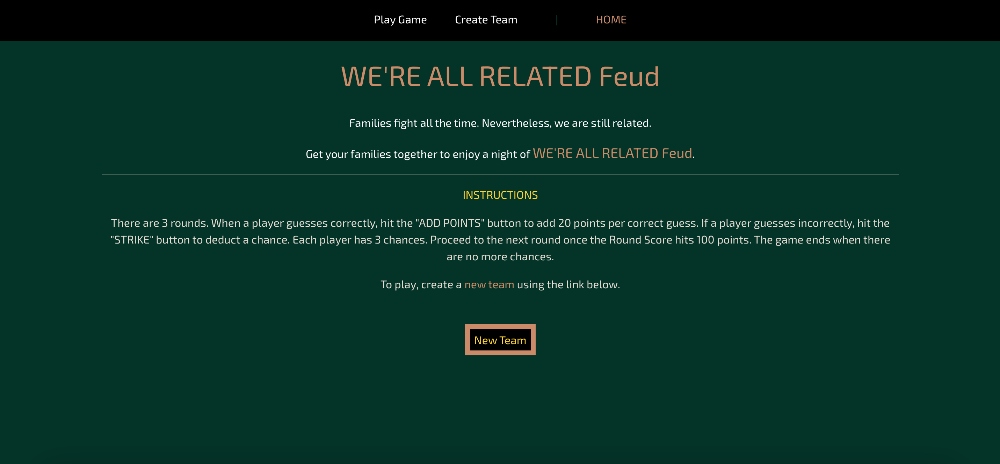

# WE'RE ALL RELATED Feud

*WE'RE ALL RELATED Feud* is a remake attempt (game application) of the daytime game show, **"Family Feud"**, hosted by Steve Harvey.

## Technologies Used:

- React
- JavaScript
- Node.js
- Express
- MongoDB
- HTML
- CSS

## Getting Started

Click here to render the app on Heroku:

https://warfeud.herokuapp.com/

The following is a link to the Trello board containing the project's planning:

https://trello.com/b/f1Ufadpd/were-all-related-feud

## Next Steps - Planned Future Enhancements (Ice Box Items):

- *Work more on authentication* 
- *Work more on the 'create a new team' feature* 
- *Adding a 'cards' section (answers) for each round* 
- *A hint button for the game* 
- *Adding 'clapping' sounds for when a user makes a correct guess*
